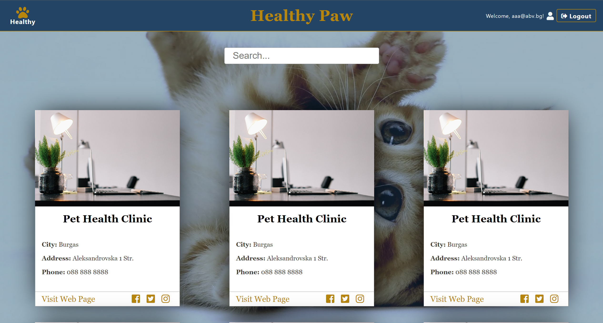
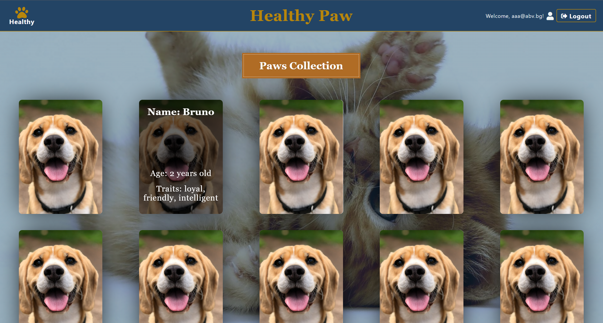
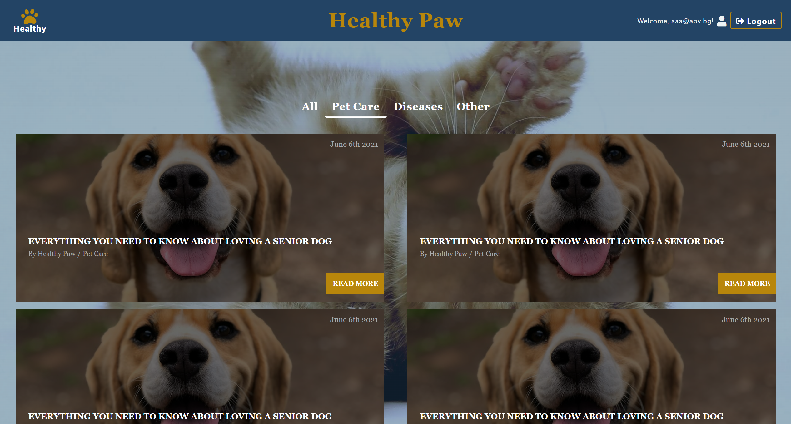

# Healthy Paw Web Application

Healthy Paw is a web app, which offers an easy and a fun way to find a vet, create and maintain a medical record of your pet, see some cute pictures and find helpful and intriguing information about your lovely companion. This is the first application developed by me using the knowledge gained from SoftUni and there are a lot of things to be further developed or improved. 

### Possible improvements

- Build a Back-End instead of using Firebase
- Create form and data validation
- Improve UI/UX - more modern design + more straight functionalities
- Create network for users to be able to see other's pet cards or photos

**Note: Firebase has test period for only 30 days and the project is not maintained anymore. Auth or any saved records could not work.**

## Technologies used

Healthy Paw Application was built using the following technologies:

- React: web app build
- JavaScript: web app's logic
- CSS: plain CSS for styling
- Back-End (Serverless) - Firebase

## Deployment

[Healthy Paw Application](https://stanimir-p.github.io/Healthy-Paw/)